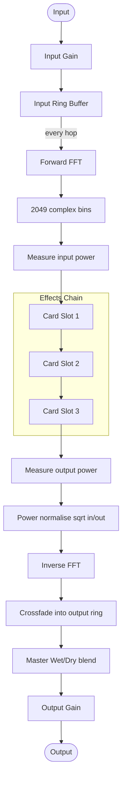

**Disclaimer: Agentic coding tools have and are being used to help create this project.**

# BlkFx


**BlkFx** is a spectral FX plugin built with JUCE, reimplementing the legendary **DtBlkFx** by Darrell Tam. It uses the same crossfade-output block processing architecture as the original, operating on overlapping FFT frames without windowing.

## Downloads
- https://github.com/toni-lyttinen/CognitoniBlkFx/releases/tag/v0.2.0-alpha

## Credits
- Original DtBlkFx algorithm and design: **Darrell Tam**
- Also thanks to **Dan Smith** for refactoring and making the DtBlkFx source code for public consumption.

## Audio Processing Architecture

The engine processes audio in overlapping spectral frames. Each frame is written back to the output ring using a linear crossfade over the overlap region (mirroring `DtBlkFx::mixToX3`), which eliminates the amplitude modulation artefact that standard overlap-add (OLA) produces at the hop rate.

```
FFT size   : 4096 samples (default, adjustable via BlackLens)
Hop size   : ~57.2 % of FFT size (~2351 samples for default 4096)
Latency    : 2 × FFT size − hop size  (≈ 133 ms @ 44.1 kHz with default BlackLens)
Output ring: 3 × FFT size
```

### Signal-flow diagram



## Effects

### BlackLens
Controls the FFT window size, trading time resolution against frequency resolution. The knob sweeps continuously from **5 ms** (very small window, fast response, coarse frequency bins) to **1830 ms** (very large window, slow response, fine frequency resolution). The default value **92.2 ms** matches the original DtBlkFx default. Internally the processor snaps to the nearest power-of-two FFT size for the current sample rate.

### AutoHarm
Detects the fundamental pitch of the input and applies amplitude shaping to its harmonic series. The frequency range controls which part of the spectrum is searched for the fundamental. The **Value** knob sweeps through four harmonic targets: **Both** (all harmonics), **Odd**, **Even**, and **Between** while also controlling band width within each mode. The **dB** knob sets the amplitude multiplier applied to each matched harmonic bin.

### Contrast
Applies a nonlinear spectral power curve across all bins in the frequency band. The **Value** knob is bipolar: positive values (0%–100%) exaggerate spectral peaks; negative values (−100%–0%) compress the spectrum toward equal amplitude. Output power is normalised to match input power. Double-clicking resets to 0%.

### Saws
Shapes the harmonic content toward a sawtooth-wave profile using pre-computed coefficient tables replicates the original DtBlkFx. The **Value** knob sweeps from **0% Scale** (no effect) through **100% Scale** (full blend toward a sawtooth spectrum) to **0% Copy** and **100% Copy**, where Copy mode replaces each harmonic region with a scaled copy of the fundamental amplitude.

### Smear
Randomises the phase (and partially the amplitude) of each spectral bin using a persistent pseudo-random binary sequence (PRBS), replicating the `SmearProcess` from DtBlkFx directly. The **Smear** knob controls the blend between the original phase (0%) and fully scrambled phase (100%). The **dB** knob controls output amplitude. Low smear values add subtle spectral diffusion; high values produce a washy, de-pitched effect.

## Features

- **Four** spectral processing cards: **AutoHarm**, **Contrast**, **Saws**, **Smear**
- Three card slots in series. Cards can be added, removed, and drag-reordered
- Per-card bypass, frequency range (Freq A / Freq B), value, and dB controls
- **BlackLens** knob with continuously adjustable FFT window size (5 ms – 1830 ms, default 92.2 ms), skew-mapped so the default sits at the knob centre
- **Randomizer** button that fills all three card slots with random card types and random parameter values in one click
- Input and output gain trims (±18 dB)
- Master Wet/Dry for global dry/processed blend
- Built-in presets from the classic DtBlkFx **AutoHarm** and **SuperSoft** presets, with author attribution ("by Darrell Tam") displayed below the selector.
- User presets saved to `%APPDATA%\CognitoniBlkFx\presets.json` (Windows)
- Save, delete, and randomize controls.

## Build Instructions

### Prerequisites

- [JUCE](https://juce.com) and Projucer
- **Windows**: Visual Studio 2022
- **macOS**: Xcode
- **Linux**: GCC or Clang

### Windows

1. Open `CognitoniBlkFx.jucer` in Projucer.
2. Verify your JUCE module paths in Projucer global settings.
3. Save/export the project from Projucer to regenerate `Builds/` and `JuceLibraryCode/`.
4. Open `Builds/VisualStudio2022/CognitoniBlkFx.sln` in Visual Studio.
5. Build `Debug` or `Release` for `x64`.

### macOS / Linux

Follow the same Projucer -> IDE -> build flow for your platform.

## Project Structure

- `CognitoniBlkFx.jucer` - Projucer project file
- `Source/` - Plugin source code
  - `SpectralEngine/` - Crossfade-output FFT processing engine (`FFTProcessor`)
  - `Cards/` - AutoHarm, Contrast, Saws, and Smear spectral card implementations
  - `PluginProcessor.cpp/.h` - JUCE audio processor, APVTS, preset management
  - `PluginEditor.cpp/.h` - JUCE plugin editor / UI

## License

GNU General Public License v3.0 or later. See `LICENSE`.
